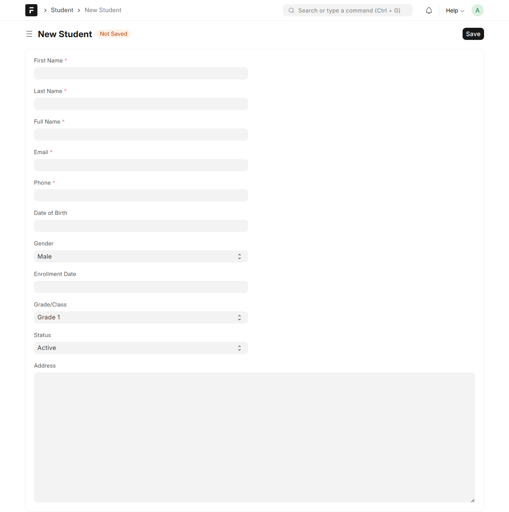
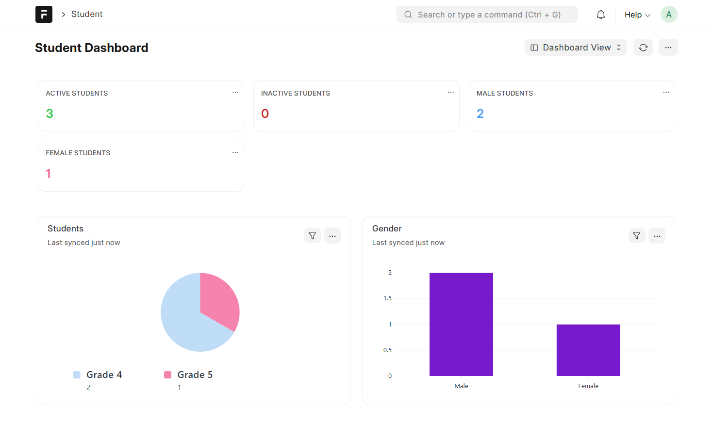

# Student Management System - WalnutEdu

A custom Frappe application for managing student information at WalnutEdu. This application provides a comprehensive solution for educational institutions to track, manage, and monitor student data efficiently.


## 📋 Table of Contents

- [Overview](#overview)
- [Features](#features)
- [System Requirements](#system-requirements)
- [Installation](#installation)
- [Usage](#usage)
- [Screenshots](#screenshots)
- [Challenges Faced & Solutions](#challenges-faced--solutions)
- [Technology Stack](#technology-stack)
- [Project Structure](#project-structure)
- [Development](#development)
- [Contributing](#contributing)
- [License](#license)
- [Author](#author)

## 🎯 Overview

The Student Management System is a custom Frappe application designed specifically for WalnutEdu to streamline student information management. Built on the Frappe Framework v15, this application enables educational institutions to:

- Maintain comprehensive student records
- Track enrollment and academic progress
- Manage student status (active, inactive, graduated)
- Organize students by grade/class
- Access student information through an intuitive web interface

This project was developed as part of a technical assessment for WalnutEdu's internship program, demonstrating proficiency in Frappe framework development, system administration, and custom application creation.

## ✨ Features

- **Student Registration & Management**: Complete CRUD operations for student records
- **Enrollment Tracking**: Track student enrollment dates and academic status
- **Contact Information Management**: Maintain student contact details and addresses
- **Grade/Class Organization**: Organize students by their respective grades or classes
- **Status Monitoring**: Monitor active, inactive, and graduated students
- **User-Friendly Interface**: Intuitive web-based interface built on Frappe's modern UI
- **Data Validation**: Built-in validation for student data integrity
- **Search & Filter**: Easy search and filtering capabilities for student records

## 🖥️ System Requirements

Before installing the Student Management System, ensure your system meets the following requirements:

### Operating System

- **Ubuntu 20.04 LTS** or higher (recommended)
- Alternative: Other Linux distributions compatible with Frappe Bench

### Software Dependencies

- **Python**: 3.10 or higher
- **MariaDB**: 10.6 or higher
- **Node.js**: 18.x or 20.x (24.x also supported)
- **Redis**: 6.0 or higher
- **Frappe Framework**: Version 15.0
- **Git**: Latest stable version

### System Resources

- **RAM**: Minimum 4GB (8GB recommended)
- **Disk Space**: At least 10GB free space
- **CPU**: Multi-core processor recommended

### Additional Requirements

- Frappe Bench installed and configured
- Proper network connectivity for package installation
- Administrative/sudo access for system configuration

## 🚀 Installation

Follow these steps to install the Student Management System on your Frappe site.

### Step 1: Prerequisites

Ensure you have Frappe Bench installed. If not, follow the official Frappe installation guide:

```bash
# Install Frappe Bench (if not already installed)
sudo apt update
sudo apt install python3-dev python3-pip python3-venv python3-setuptools
sudo apt install mariadb-server mariadb-client
sudo apt install redis-server
sudo apt install git curl

# Install Node.js (using nvm is recommended)
curl -o- https://raw.githubusercontent.com/nvm-sh/nvm/v0.39.0/install.sh | bash
nvm install 18

# Install Bench
sudo pip3 install frappe-bench

# Initialize a new bench (if you don't have one)
bench init frappe-bench
cd frappe-bench
```

For detailed installation instructions, refer to the [Frappe Framework Documentation](https://frappeframework.com/docs/user/en/installation).

### Step 2: Get the Application

Clone or get the Student Management application into your Frappe bench:

```bash
# Navigate to your bench directory
cd ~/frappe-bench

# Get the app from GitHub
bench get-app https://github.com/laveshparyani/walnutedu-student-management.git
# Or if you have it locally, navigate to the directory and use:
# bench get-app student_management .

# Alternatively, if you have the app locally
bench get-app student_management /path/to/student_management
```

### Step 3: Create a New Site (if needed)

If you don't have a site yet, create one:

```bash
# Create a new site
bench new-site your-site.localhost

# Set administrator password when prompted
```

### Step 4: Install the App on Your Site

Install the Student Management app on your site:

```bash
# Install the app
bench --site your-site.localhost install-app student_management

# If the site already exists and you're adding the app
bench --site your-site.localhost install-app student_management
```

### Step 5: Start the Development Server

Start the Frappe development server:

```bash
# Start bench (this starts all services)
bench start

# Or start specific services
bench start --only-web
bench start --only-worker
```

### Step 6: Access the Application

1. Open your web browser
2. Navigate to `http://your-site.localhost:8000`
3. Login with the administrator credentials
4. The Student Management app will be available in the app menu

## 📖 Usage

### Creating a New Student Record

1. **Login** to your Frappe site
2. **Search** for "Student" in the awesome bar (search bar at the top)
3. Click **"New"** to create a new student record
4. **Fill in** the student details:
   - Student Name
   - Enrollment Date
   - Grade/Class
   - Contact Information
   - Status (Active/Inactive/Graduated)
   - Any other required fields
5. Click **"Save"** to save the record

### Viewing Student Records

1. Search for "Student" in the awesome bar
2. You'll see a list of all student records
3. Click on any student name to view detailed information
4. Use the search and filter options to find specific students

### Editing Student Information

1. Open the student record you want to edit
2. Make the necessary changes
3. Click "Save" to update the record

### Managing Student Status

1. Open a student record
2. Update the status field (Active/Inactive/Graduated)
3. Save the changes

## 📸 Screenshots

### Student List View

View all students in a organized list format with search and filter capabilities.


### Student Form View

Create and edit student records with an intuitive form interface.



### Student Dashboard

Monitor student statistics and overview with the dashboard view.



## 🔧 Challenges Faced & Solutions

During the development of this application, several challenges were encountered and resolved. Here's a detailed account:

### Challenge 1: MariaDB Configuration & Character Encoding

**Issue**:
During initial setup, the application encountered character encoding issues, particularly with special characters and Unicode support. This caused problems when storing student names with non-ASCII characters.

**Solution**:

- Configured MariaDB to use UTF8MB4 character encoding
- Modified `/etc/mysql/my.cnf` to include:

  ```ini
  [mysql]
  default-character-set = utf8mb4

  [mysqld]
  character-set-server = utf8mb4
  collation-server = utf8mb4_unicode_ci
  ```

- Restarted MariaDB service
- Recreated the database with proper encoding
- Verified encoding with `SHOW VARIABLES LIKE 'character_set%'`

**Learning**: Proper database configuration is crucial for international character support in educational applications.

### Challenge 2: Virtual Environment & Package Management

**Issue**:
Encountered permission errors when installing Python packages using pip. This was particularly problematic when trying to install Frappe and its dependencies in a system-wide Python environment.

**Solution**:

- Used `pipx` for isolated bench installation to avoid conflicts
- Created virtual environments for each Frappe bench
- Used `bench` command-line tool which handles virtual environments automatically
- Ensured proper user permissions for the bench directory
- Used `--user` flag as a fallback when needed

**Learning**: Isolated environments prevent dependency conflicts and permission issues in multi-project setups.

### Challenge 3: Understanding Frappe's DocType System

**Issue**:
Initially struggled with understanding Frappe's ORM (Object-Relational Mapping) and field types. Creating custom DocTypes with proper field configurations required understanding Frappe's meta framework.

**Solution**:

- Studied official Frappe documentation extensively
- Experimented with different field types (Data, Link, Date, Select, etc.)
- Used Frappe's built-in DocType builder in the UI to understand field configurations
- Referenced existing Frappe apps for best practices
- Learned about Frappe's JSON-based DocType definitions
- Understood the relationship between DocTypes, Forms, and List Views

**Learning**: Frappe's meta framework is powerful but requires understanding of its unique approach to data modeling.

### Challenge 4: Frappe Bench Setup on WSL

**Issue**:
Setting up Frappe Bench on Windows Subsystem for Linux (WSL) presented unique challenges with file permissions, service management, and path handling.

**Solution**:

- Configured WSL with proper Ubuntu distribution
- Set up systemd for service management (if needed)
- Handled Windows-WSL file system interactions carefully
- Used WSL-specific paths and configurations
- Ensured proper permissions for bench directory
- Configured Redis and MariaDB to start automatically in WSL

**Learning**: WSL requires additional configuration considerations compared to native Linux installations.

### Challenge 5: Git Repository Setup & Remote Configuration

**Issue**:
Initial git repository setup had ownership and remote configuration issues, making it difficult to push code to GitHub.

**Solution**:

- Configured git safe directories for WSL paths
- Set up proper git user configuration
- Added remote repository correctly
- Handled file permissions for git operations
- Used proper authentication (SSH keys or HTTPS with token)

**Learning**: Proper git configuration is essential for version control and collaboration.

## 🛠️ Technology Stack

This application is built using the following technologies:

- **Framework**: Frappe Framework v15.0
- **Backend Language**: Python 3.10+
- **Database**: MariaDB 10.6+
- **Frontend**: Frappe's built-in UI (based on Vue.js)
- **Cache**: Redis 6+
- **Runtime**: Node.js 18.x/20.x
- **Version Control**: Git
- **Package Management**: pip, npm
- **Build Tool**: Frappe Bench

## 📁 Project Structure

```
student_management/
├── student_management/
│   ├── __init__.py
│   ├── hooks.py           # App configuration and hooks
│   ├── modules.txt        # App modules
│   ├── patches.txt        # Database migration patches
│   ├── config/            # Configuration files
│   ├── public/            # Public assets (CSS, JS)
│   ├── templates/         # Jinja templates
│   └── www/               # Web pages
├── screenshots/           # Application screenshots
├── pyproject.toml         # Python project configuration
├── README.md              # This file
├── license.txt            # MIT License
└── .gitignore            # Git ignore rules
```

## 💻 Development

### Setting Up Development Environment

1. Clone the repository
2. Install dependencies using Frappe Bench
3. Create a development site
4. Install the app in development mode
5. Make your changes
6. Test thoroughly
7. Commit and push changes

### Running Tests

```bash
# Run tests for the app
bench --site your-site.localhost run-tests --app student_management
```

### Code Style

This project follows Frappe's coding standards:

- Python code follows PEP 8 guidelines
- JavaScript code follows Frappe's ESLint configuration
- Uses Ruff for Python linting
- Tab indentation for Python files

### Building for Production

```bash
# Build assets
bench build --app student_management

# Clear cache
bench --site your-site.localhost clear-cache
```

## 🤝 Contributing

Contributions are welcome! If you'd like to contribute to this project:

1. Fork the repository
2. Create a feature branch (`git checkout -b feature/AmazingFeature`)
3. Make your changes
4. Commit your changes (`git commit -m 'Add some AmazingFeature'`)
5. Push to the branch (`git push origin feature/AmazingFeature`)
6. Open a Pull Request

Please ensure your code follows the project's coding standards and includes appropriate tests.

## 📄 License

This project is licensed under the MIT License - see the [LICENSE](license.txt) file for details.

## 👤 Author

**Lavesh Paryani**

- Email: laveshparyani01@gmail.com
- GitHub: [@laveshparyani](https://github.com/laveshparyani)
- Project Link: [https://github.com/laveshparyani/walnutedu-student-management](https://github.com/laveshparyani/walnutedu-student-management)

## 🙏 Acknowledgments

- Frappe Framework team for the amazing framework
- WalnutEdu for the opportunity to work on this project
- Frappe community for documentation and support

## 📝 Additional Notes

- This application is built specifically for Frappe Framework v15
- Ensure all system requirements are met before installation
- Regular backups are recommended for production environments
- For production deployment, consider using Frappe's production setup with Nginx and supervisor

---

**Note**: This application was developed as part of a technical assessment. For production use, additional features like user authentication, role-based permissions, and data export capabilities may be needed.
