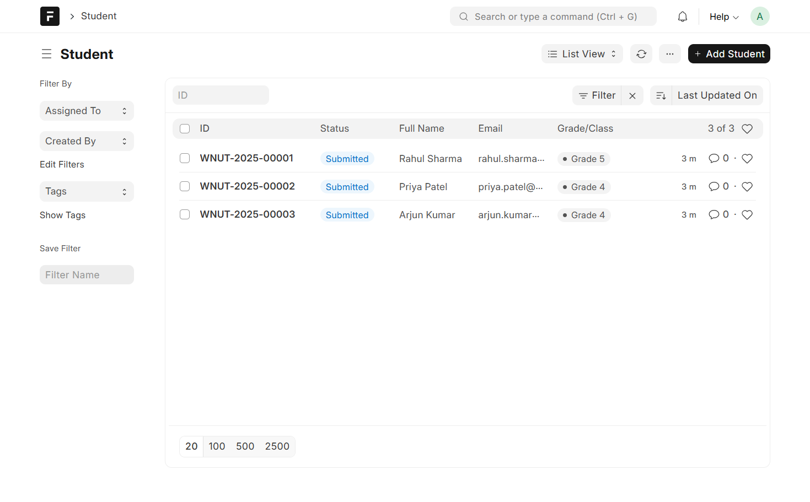
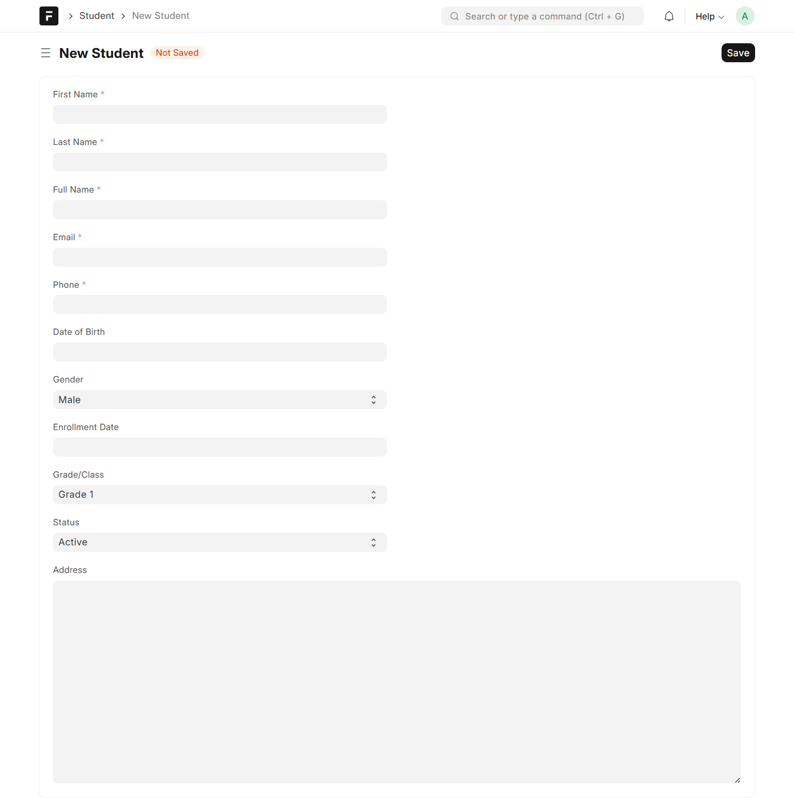
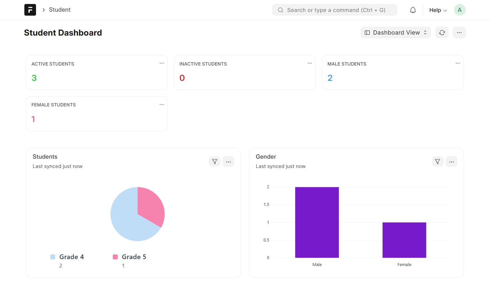

# Student Management System – WalnutEdu

A custom [Frappe Framework](https://frappeframework.com/) v15 app for managing student
records: a **Student** DocType with a `WNUT-YYYY-#####` naming series, a dashboard with
live counts and charts, and a workspace to tie it together. Everything is defined in code,
so `bench install-app` gives you the complete app on any site.


[](https://github.com/laveshparyani/walnutedu-student-management/actions/workflows/ci.yml)

Built as the technical assessment for WalnutEdu's internship programme.

## Demo

[](https://youtu.be/hXrQZdH23DI)

**Click the thumbnail to watch the walkthrough on YouTube.**

### Why there is no live URL yet

Frappe needs MariaDB, Redis, background workers and about 2 GB of RAM, which is more than
the free tiers of Render, Railway, Fly.io or Koyeb offer. This is a personal project, so it
is not hosted on any company infrastructure either. A permanently free option is an
[Oracle Cloud Always Free](https://www.oracle.com/cloud/free/) VM, which is on the roadmap.
Until then the video and the screenshots below show the app running.

## Features

- **Student records** with personal details, contact information, enrollment date,
  grade/class and status (Active, Inactive, Graduated).
- **Auto-numbering** as `WNUT-2025-00001`, and a submittable workflow (Draft → Submitted).
- **Validation:** unique, well-formed email; phone format; date of birth not in the future;
  enrollment date not before date of birth; full name derived from first and last name.
- **Dashboard** with number cards (active, inactive, male, female students) and charts
  (students by grade, students by gender).
- **Workspace** with shortcuts to the Student list and the dashboard.
- **Tests** for the validation rules, run in CI on every pull request.

## Screenshots

| Student list | Student form |
|---|---|
|  |  |



## Installation

Requires a working [Frappe Bench](https://frappeframework.com/docs/user/en/installation)
with Frappe v15 (Python 3.10+, MariaDB 10.6+, Redis, Node 18+).

```bash
cd frappe-bench
bench get-app https://github.com/laveshparyani/walnutedu-student-management.git
bench new-site student.localhost          # skip if you already have a site
bench --site student.localhost install-app student_management
bench --site student.localhost migrate
bench start
```

Then open `http://student.localhost:8000`, log in as Administrator and pick the
**Student Management** workspace.

## Project structure

```
student_management/
├── hooks.py                      # app metadata
├── modules.txt
├── patches.txt
└── student_management/           # the "Student Management" module
    ├── doctype/student/          # Student DocType: schema, controller, form script, tests
    ├── number_card/              # Active / Inactive / Male / Female Students
    ├── dashboard_chart/          # Students by Grade (pie), Students by Gender (bar)
    ├── dashboard/                # Student Dashboard
    └── workspace/                # Student Management workspace
```

## Development

```bash
cd apps/student_management
pre-commit install                                   # ruff, prettier, eslint
bench --site student.localhost set-config allow_tests true
bench --site student.localhost run-tests --app student_management
```

See [CONTRIBUTING.md](.github/CONTRIBUTING.md) for the branch and PR workflow, and
[SECURITY.md](.github/SECURITY.md) for reporting security issues.

## License

[MIT](LICENSE) © 2025 Lavesh Paryani

## Author

**Lavesh Paryani** · [@laveshparyani](https://github.com/laveshparyani) · laveshparyani01@gmail.com
